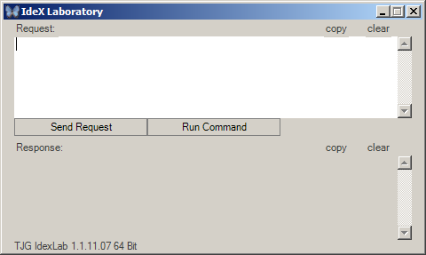
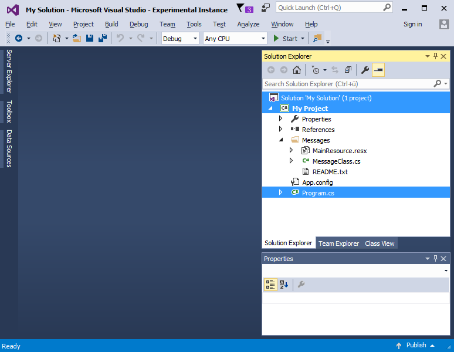

# IdeX

IdeX allows your application to easily get data from Visual Studio. For example get the current selected text or the current selected items from the solution explorer programmatically.

- Your application can be written in almost any language.
- IdeX is compact, robust and extremely fast. See chapter "Technical background".
- IdeX is easy to use. The "Getting Started" chapter explains how to integrate IdeX into your own application.
- The IdeX user interface integrates seamlessly into Visual Studio.
- The performance of Visual Studio itself is not impacted.

## Technical background
IdeX is an acronym for Integrated Development Environment Extension. It uses IPC (Inter Process Communication) to shift data between Visual Studio and an external process for example your application. 
The IdeX server integrates into Visual Studio and the IdeX client integrates into the external process. The external process sends a request to the server. Based on the request, the server collects data and sends a response back to the client. The request is a simple string which adheres to the IdeX Syntax.

## Download
[](https://ci.appveyor.com/project/TooJooGoo/idex)

Get the latest IdeX version here:
 - Vsix gallery: [Download](http://vsixgallery.com/extension/8F047980-8107-4E48-B836-571A2AAAFA3C)
 - Visual Studio gallery: [Download](https://visualstudiogallery.msdn.microsoft.com/a53074bd-cf8d-4be7-8eb6-2b768a45b96b)

## Getting Started
This chapter explains how easy it is to setup IdeX and how you can include its features in your own application.

### Start the server
In Visual Studio click menu item "Tools/IdeX/Enable".
The IdeX server is now enabled.

### Start the client
In Visual Studio click the menu item "Tools/IdeX/Lab"
The IdeX laboratory is started.



The IdeX Lab is a standalone process simulating an IdeX client. The IdeX Lab is an environment for testing new requests against the IdeX server.
When you are done with a request, you can copy it to your own app.

### Sample Usage
The following sample shows how to write a request which gets all items currently selected in the solution explorer.

Open an arbitrary Visual Studio project and select some items in the solution explorer.
The example below shows the solution explorer with three selected items.



Go to the IdeX Lab and enter the following code into the request window at the top:

	g SolutionExplorer.Selection.ItemCount

The prefix "g" indicates a "get" operation. The string "SolutionExplorer.Selection.ItemCount" is the object to operate on. Press button "Send Request" or type "ALT+Enter" to send the request.
The response window at the bottom should yield the following text:

	3
We just asked Visual Studio how many items are selected in the solution explorer.

Now enter the following request and send it:

	g SolutionExplorer.Selection.Items

The response window should yield a text similar to this:

	ObjectCount = 3
	ObjectProperties = Type,Kind,Name,Path
	0
	Type = Solution
	Kind = Solution
	Name = My Solution
	Path = E:\Vs\CopyData\My Solution.sln
	1
	Type = Project
	Kind = CSharp
	Name = My Project
	Path = E:\Vs\CopyData\CopyData\
	2
	Type = ProjectItem
	Kind = PhysicalFile
	Name = Program.cs
	Path = E:\Vs\CopyData\CopyData\Program.cs

We just asked Visual Studio what kind of items are selected in the solution explorer.

To emit a request from your own application, just include the [IdexPipe](IdexPipe.md) class in your project.

In your application (in this example C#) you can emit the request programmatically:

```csharp
IdexPipe.Encoding = IdexPipe.Unicode;
var request = "g SolutionExplorer.Selection.Items";
var response = IdexPipe.Send(request);
```

You only need to put the request string into the Send method. The rest is done behind the scenes. The Send method is executed synchronously. The response string holds the selected items as shown above.

Learn more about the IdeX syntax in [IdeX syntax](IdexSyntax.txt).

## Features
The most popular features are:
- Get selected items
  - Gets the current selected items from the solution explorer.
- Get selected text
  - Gets the current selected text from the active document.
- Get open documents
  - Gets the current opened documents.

## Changelog
See the change log here: [Change log](CHANGELOG.md)

## Contribute
See the contribution guidelines here: [Contribution guidelines](CONTRIBUTING.md)

## License
Inspect the license file here: [License](LICENSE)
